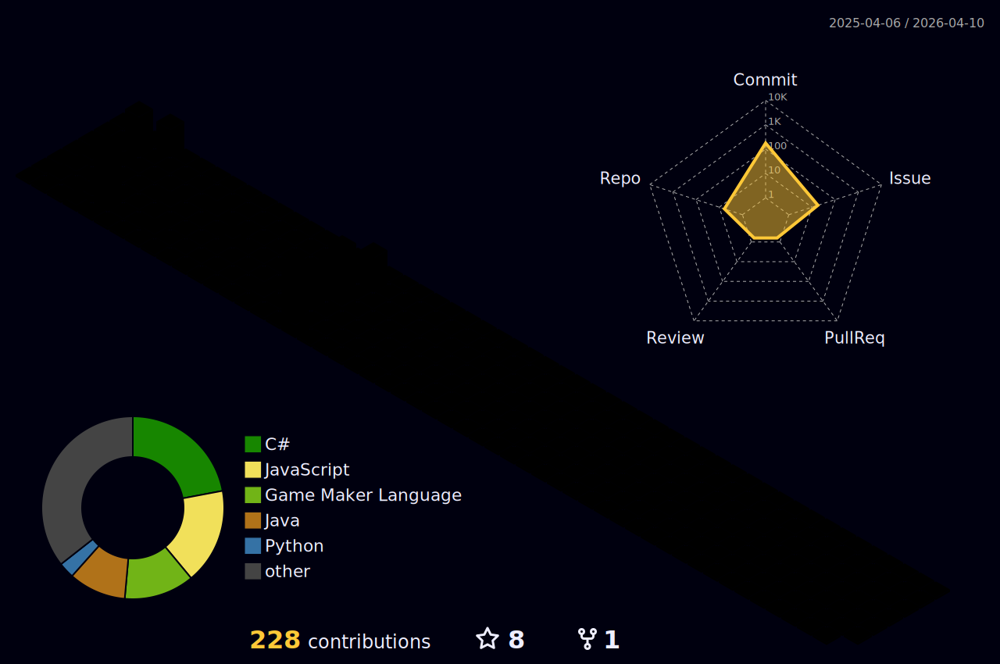

  

### 🧱 3D Contribution Graph

#

  I am a 4th period Computer Science student, with intermediate knowledge in C++ and Java, focused on Spring Boot for developing backend applications. Currently, I'm delving deeper into C++ libraries, like OpenGL, external to computer graphics, as well as graphical interfaces like GTK and QT. I also have practical experience in assembling computers, which gives me a comprehensive view of hardware and software. I'm looking for an internship or job opportunity where I can apply my knowledge, face real challenges and collaborate with development teams.

<h3 align="left">Connect with me!</h3>

<h3 align="left">My Stacks ~</h3>

  
  
  
  
  
  
  
  
  
  
  
  
  
  
  
  
  
  
  

#

### 🐍 Contribution Snake Animation

<picture align="center">
  <source media="(prefers-color-scheme: dark)" srcset="https://raw.githubusercontent.com/mari4souza/mari4souza/output/github-contribution-grid-snake-dark.svg">
  <source media="(prefers-color-scheme: light)" srcset="https://raw.githubusercontent.com/mari4souza/mari4souza/output/github-contribution-grid-snake-dark.svg">
  
</picture>

#

## 🏆 GitHub Trophies

#

## 📊 GitHub Stats

  

#

## 🌐 My Portfolio

🔗 [ronnyrocke.github.io/.-portfolioronny](https://ronnyrocke.github.io/.-portfolioronny)
