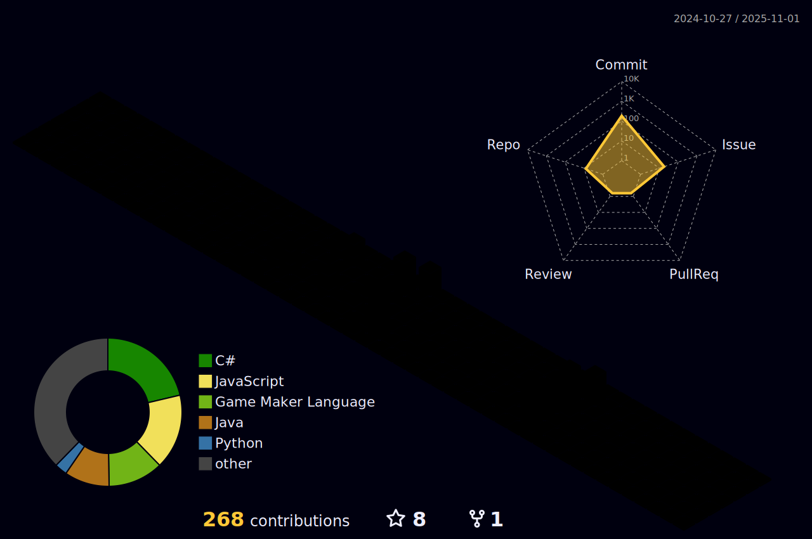

  

    

  <h3>🌐 Meu Portfólio</h3>
  <a href="https://ronnyrocke.github.io/.-portfolioronny" target="_blank">ronnyrocke.github.io/.-portfolioronny</a>  

  
  

 

---

  Sou estudante do 4º período de Ciência da Computação, com conhecimento intermediário em C++ e Java, focado em Spring Boot para desenvolvimento de aplicações backend. Atualmente, estou me aprofundando em bibliotecas C++ como OpenGL, voltadas para computação gráfica, e interfaces gráficas como GTK e QT. Também tenho experiência prática com montagem de computadores, o que me dá uma visão ampla de hardware e software. Estou em busca de uma oportunidade de estágio ou emprego onde eu possa aplicar meus conhecimentos, enfrentar desafios reais e colaborar com equipes de desenvolvimento.

  

---

## 📊 Estatísticas do GitHub

   

 

---

### 💻 Tecnologias que uso

  
  
  
  
  
  
  
  
  
  
  
  
  
  
  
  
  
  
  

---

<picture>
  <source media="(prefers-color-scheme: dark)" srcset="https://raw.githubusercontent.com/mari4souza/mari4souza/output/github-contribution-grid-snake-dark.svg">
  <source media="(prefers-color-scheme: light)" srcset="https://raw.githubusercontent.com/mari4souza/mari4souza/output/github-contribution-grid-snake.svg">
  
</picture>

---

### 🤝 Conecte-se comigo

---

### 🏆 Troféus do GitHub

 
---
